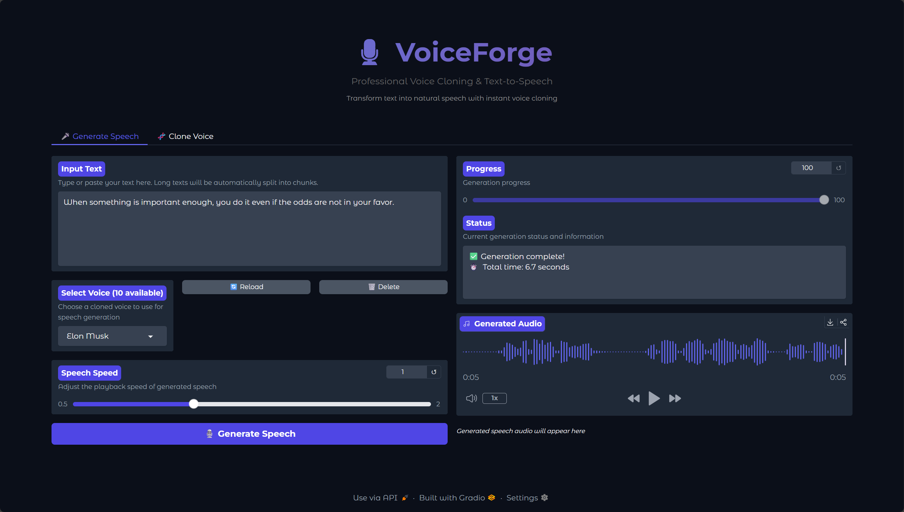

# 🎙️ VoiceForge

<div align="center">

**Voice Cloning & Text-to-Speech Application**

[](https://www.python.org/)
[](LICENSE)
[](https://gradio.app/)

*Transform text into natural speech with instant voice cloning capabilities*

[Features](#-features) • [Screenshots](#-screenshots--examples) • [Quick Start](#-quick-start) • [Usage](#-usage) • [Documentation](#-documentation)

</div>

---

## 🌟 Overview

VoiceForge is a modern, professional-grade voice cloning and text-to-speech application built on **NeuTTS Air** by Neuphonic. It provides an intuitive web interface for creating voice clones from just 3-15 seconds of reference audio and generating high-quality speech synthesis.

### Powered by NeuTTS Air

VoiceForge leverages [NeuTTS Air](https://neutts.org/), an open-source (Apache 2.0) on-device text-to-speech model that:

- **Runs entirely on-device** - No cloud API required, ensuring data privacy
- **Instant voice cloning** - Replicate voices from 3-15 seconds of reference audio
- **Real-time performance** - Optimized for low-latency streaming
- **Responsible AI** - Includes "Perth" watermarking for traceability
- **0.5B parameter LLM** - Built on Qwen backbone with NeuCodec (50Hz neural audio codec)
- **Multiple formats** - Supports PyTorch, GGML/GGUF, and ONNX

Learn more: [neutts.org](https://neutts.org/) | [Hugging Face](https://huggingface.co/spaces/neuphonic/neutts-air) | [GitHub](https://github.com/neuphonic/neutts-air)

## 📸 Screenshots & Examples

### Application Interface

<div align="center">
  
  <p><em>VoiceForge Web Interface - Generate Speech Tab</em></p>
</div>

### Example: Elon Musk Voice Clone

**Text Input:**
> "When something is important enough, you do it even if the odds are not in your favor."

**Generated Audio:**

<audio controls>
  <source src="assets/elonmusk.wav" type="audio/wav">
  Your browser does not support the audio element.
</audio>

*Generated using the Elon Musk voice clone - 5 seconds, generated in 6.7 seconds*

## ✨ Features

- 🎙️ **Instant Voice Cloning**: Clone any voice from 3-15 seconds of reference audio
- 🚀 **GPU Acceleration**: CUDA support for fast inference (CPU fallback available)
- 🌐 **Modern Web Interface**: Beautiful, user-friendly Gradio interface
- 📱 **On-Device Processing**: Runs locally, no cloud API required
- 🔒 **Watermarked Outputs**: All generated audio includes imperceptible watermarks
- 🏗️ **Modular Architecture**: Clean, maintainable codebase with separation of concerns
- ⚙️ **Configurable**: Easy customization through settings
- 📝 **Comprehensive Logging**: File and console logging for debugging
- 🎨 **Professional UI**: Modern interface with VoiceForge branding

## 📋 Requirements

### System Requirements

- **OS**: Linux (Ubuntu 20.04+, Debian 11+, Arch Linux, Fedora, etc.)
- **Python**: 3.11 or higher
- **RAM**: 8GB minimum (16GB recommended)
- **GPU**: NVIDIA GPU with CUDA support (optional but recommended)
- **Disk Space**: ~5GB for models and dependencies

### System Dependencies

- **eSpeak-ng**: For phonemization (text-to-phoneme conversion)

## 🚀 Quick Start

### 1. Install System Dependencies

**Ubuntu/Debian:**
```bash
sudo apt update
sudo apt install -y espeak-ng espeak-data libespeak1 libespeak-dev python3 python3-pip python3-venv
```

**Arch Linux:**
```bash
sudo pacman -S espeak-ng python python-pip
```

**Fedora:**
```bash
sudo dnf install espeak-ng espeak-ng-devel python3 python3-pip
```

**macOS:**
```bash
brew install espeak-ng
```

### 2. Clone the Repository

```bash
git clone https://github.com/yourusername/VoiceForge.git
cd VoiceForge
```

### 3. Run Setup Script

```bash
chmod +x setup_linux.sh
./setup_linux.sh
```

This will:
- Install system dependencies
- Create Python virtual environment
- Install Python packages
- Set up directories

### 4. Run the Application

**Option 1: Using the run script (Recommended)**
```bash
chmod +x run_neutts.sh
./run_neutts.sh
```

**Option 2: Manual activation**
```bash
source .venv/bin/activate
python main.py
```

The web interface will open at `http://localhost:7860`

> **Note**: First run will download models from HuggingFace (~2-4 GB). This may take 5-15 minutes depending on your connection.

## 📖 Usage

### Cloning a Voice

1. Go to the **"🧬 Clone Voice"** tab
2. Enter a name for your voice (e.g., `my_voice`, `narrator`)
3. Upload a reference audio file (`.wav` format, 3-15 seconds)
4. Enter the exact text spoken in the audio
5. Click **"🧬 Clone Voice"**

**Reference Audio Requirements:**
- Format: WAV
- Sample rate: 16-44 kHz
- Channels: Mono
- Duration: 3-15 seconds
- Quality: Clear, minimal background noise

### Generating Speech

1. Go to the **"🎤 Generate Speech"** tab
2. Select a cloned voice from the dropdown
3. Enter the text you want to synthesize
4. Adjust speed (optional, 0.5x to 2.0x)
5. Click **"🎙️ Generate Speech"**

The system will:
- Split long texts into chunks automatically
- Generate audio for each chunk
- Combine chunks with proper spacing
- Apply speed adjustment
- Return the final audio file

## 🏗️ Project Structure

VoiceForge features a professional, modular architecture:

```
VoiceForge/
├── main.py                 # Main entry point
├── voiceforge/             # Main package
│   ├── config/             # Configuration management
│   ├── models/             # Model loading
│   ├── services/           # Business logic (TTS, Voice management)
│   ├── ui/                 # User interface components
│   └── utils/              # Utilities (logging, system checks)
├── neuttsair/              # Core TTS module (modularized)
│   ├── config.py           # TTS configuration constants
│   ├── audio_utils.py      # Audio processing utilities
│   └── neutts.py           # Main NeuTTSAir class
├── samples/                # Voice samples directory
├── Models/                 # Model cache (auto-created)
├── temp/                   # Temporary files (auto-created)
└── logs/                   # Application logs (auto-created)
```

## 🔧 Configuration

### Custom Device Selection

Edit `voiceforge/config/settings.py` to change device:

```python
model = ModelConfig(
    backbone_device="cuda",  # or "cpu" or "auto"
    codec_device="cuda"
)
```

### Changing Port

Edit `voiceforge/config/settings.py`:

```python
ui = UIConfig(
    server_port=7861  # Change port number
)
```

### Using Local Models

Place models in `Models/neutts-air/` directory:
```
Models/
└── neutts-air/
    └── models--neuphonic--neutts-air/
        └── snapshots/
            └── [snapshot-hash]/
                ├── config.json
                └── ...
```

## 🐛 Troubleshooting

### eSpeak Not Found

**Error**: `Error: espeak-ng not found!`

**Solution**:
```bash
# Ubuntu/Debian
sudo apt install espeak-ng

# Arch Linux
sudo pacman -S espeak-ng

# Verify installation
which espeak-ng
```

### CUDA Not Available

**Warning**: `CUDA not available, using CPU`

**Solutions**:
1. Install NVIDIA drivers: `sudo apt install nvidia-driver-xxx`
2. Install CUDA toolkit (if needed)
3. Install PyTorch with CUDA: `pip install torch --index-url https://download.pytorch.org/whl/cu118`

### Model Download Fails

**Error**: Model download timeout or failure

**Solutions**:
1. Check internet connection
2. Increase timeout in code
3. Download models manually from HuggingFace
4. Place in `Models/neutts-air/` directory

### Out of Memory

**Error**: CUDA out of memory

**Solutions**:
1. Use CPU mode (slower but uses less memory)
2. Reduce text chunk size
3. Use quantized models (GGUF format)
4. Close other GPU applications

### Audio Generation Fails

**Error**: Failed to generate audio

**Solutions**:
1. Verify reference audio format (WAV, mono, 16-44kHz)
2. Check text encoding (UTF-8)
3. Ensure reference text matches audio exactly
4. Check disk space

## 💡 Performance Tips

1. **Use GPU**: Significantly faster than CPU
2. **Pre-encode voices**: Saves `.pt` files for faster loading
3. **Optimize reference audio**: Use clear, 5-10 second samples
4. **Batch processing**: Process multiple texts in sequence
5. **Monitor memory**: Close other applications when using GPU

## 📚 Documentation

- [QUICK_START.md](QUICK_START.md) - Quick start guide
- [TESTING.md](TESTING.md) - Testing guide
- [CONTRIBUTING.md](CONTRIBUTING.md) - Contribution guidelines
- [AUTHORS.md](AUTHORS.md) - Project authors and contributors

## 🤝 Contributing

Contributions are welcome! Please read [CONTRIBUTING.md](CONTRIBUTING.md) for details on our code of conduct and the process for submitting pull requests.

## 📄 License

This project is licensed under the MIT License - see the [LICENSE](LICENSE) file for details.

### Third-Party Licenses

This project uses:
- **NeuTTS Air** by Neuphonic - Apache 2.0 License
- **NeuCodec** by Neuphonic - See their repository for license
- **Perth Watermarking** by Resemble AI - See their repository for license

Please refer to the original repositories for their license terms:
- [NeuTTS Air](https://github.com/neuphonic/neutts-air)
- [Neuphonic](https://www.neuphonic.com/)

## 🙏 Credits

- **Author**: Otmane El Bourki <otmane.elbourki@gmail.com>
- **NeuTTS Air**: [Neuphonic](https://www.neuphonic.com/) - Open-source on-device TTS model
- **VoiceForge**: Professional modular implementation and UI

## 🔗 Links

- **NeuTTS Air Official**: [neutts.org](https://neutts.org/)
- **Hugging Face Space**: [neuphonic/neutts-air](https://huggingface.co/spaces/neuphonic/neutts-air)
- **GitHub Repository**: [neuphonic/neutts-air](https://github.com/neuphonic/neutts-air)

## ⭐ Star History

If you find VoiceForge useful, please consider giving it a star! ⭐

---

<div align="center">

**Made with ❤️ by Otmane El Bourki using NeuTTS Air**

*Enjoy professional voice cloning with VoiceForge! 🎙️✨*

</div>
